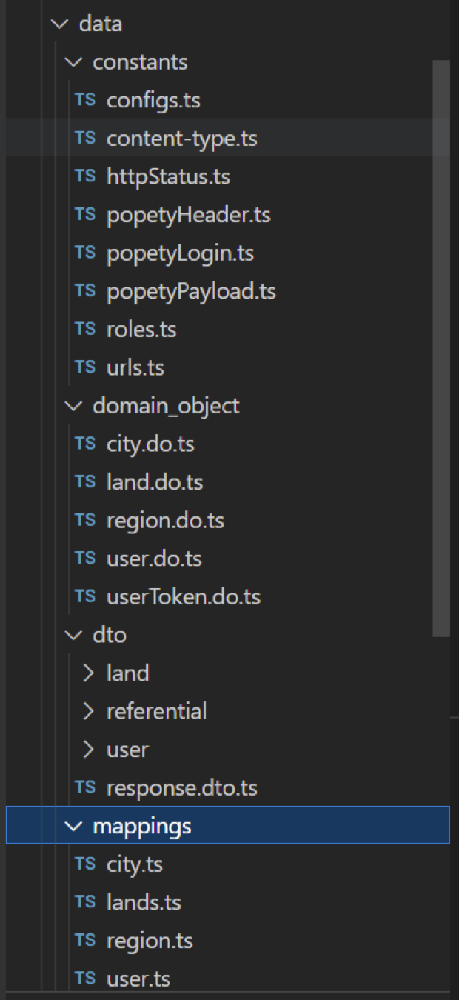

**1.1)	 Installation elasticsearch :**
-
-	Java 17 pour linux : https://download.oracle.com/java/17/archive/jdk-17.0.7_linux-x64_bin.deb 
-	Java 17 pour windows : https://download.oracle.com/java/17/archive/jdk-17.0.7_windows-x64_bin.exe 

**Configuration de JAVA:**
- Pour linux : https://linuxhint.com/set-java-home-linux/ 
- Pour Windows, suivant les captures suivantes :

**Télécharger Elasticsearch:**

- Pour windows: https://artifacts.elastic.co/downloads/elasticsearch/elasticsearch-8.3.2-windows-x86_64.zip 
- Pour linux: préférable sous docker : https://www.docker.elastic.co/r/elasticsearch/elasticsearch:8.3.2

-	Décomprésser le zip téléchargé et aller dans le dossier C:\elasticsearch-8.3.2\bin
-	Lancer Elasticsearch en double cliquant sur le fichier : elasticsearch

-	Tester Elasticsearch avec l’url localhost:9200

**1.2)	 Installation du node :**
-
-	Pour linux : https://computingforgeeks.com/install-node-js-14-on-ubuntu-debian-linux/ 
-	Pour Windows, télécharger et installer le package sur ce lien : https://nodejs.org/dist/v14.20.0/node-v14.20.0-x64.msi 
-	Vérifier avec la commande « node –version » => v14.20.0
 
1.3)	 Installation du back :
-

-	**Exécuter la commande**
    - npm install
    - npm run build 
    - node .\dist\index.js
 
-	Vérifier avec l’url : http://localhost:9000/api/api-status

1.3.1)	 Import des données
-
-	Importer les régions à partir de l’url : http://localhost:9000/api/region/populate depuis postman avec token dans x-access-token du header. Les données se trouve dans le dossier "**popety**" du projet
 
-	Importer les communes à partir de l’url : http://localhost:9000/api/city/populate depuis postman avec token dans x-access-token du header. Les données se trouve dans le dossier popety du projet

-	Vous pouvez utiliser l’importation direct en local en utilisant les fichiers de parcelle qui se trouve dans le dossier popety du projet. Voici l’url d’importation local :  http://localhost:9000/api/lands/populate?region=geneve avec le paramètre geneve correspond au fichier « region-geneve.json » qui se trouve dans le dossier popety.

Si l’importation des données s’est bien passé, on aura un résultat sur région et/ou city et/ou lands : http://localhost:9200/regions/_search?pretty

2.0)	 Codes sources backend
-

-	Le back est un projet Node express utilisant Elasticsearch pour base de données
-	Le choix d’Elasticsearch est basé sur l’analyse de pertinence des données dans la recherche ainsi que le moteur de recherche de l’application
-	Le choix de Node express est que c’est une technologie qui est très utilisé dans le backend avec javascript et que tout le monde peut l’utiliser aisément, en plus la communauté est très large. Et enfin la technologie offre des briques de fonctionnalité prête à utiliser.
-	Le projet peut se lancer sur docker via la commande « sh docker-up.sh » sous linux

-	L’architecture utilisé est le n-tier constitué de:
    - L’infrastructure : qui est le point d’entrer de l’api : route + controller. Dans le route, on trouve les path de l’api et dans le controller le http handler de l’api
    

    - Services qui contiennent les services business pour les règles de gestion et de métier de chaque fonctionnalitées. Les services delegate pour les appels à d’autre api externe du projet comme popety par exemple. Et les services middleware (là où on met les codes qui interceptent des évènements comme http, exception, …)
    

    - Repository :
C’est la couche qui interagie avec la base de données pour faire de la requêtage et de la sauvegarde.
    

    - Data :
C’est un dossier qui contient toute les fichiers qui correspondent aux données que ce soit de la base de données (Domain object) ou  des données qui interagi avec l’extérieur du projet (les dto = data transfert object). Les constants utilisé dans le projet. Et les mappings de configuration des données dans Elasticsearch
    

    - Common :
C’est un dossier qui contient les services commun fréquemment utilisé partout dans le projet à savoir les factory qui implémente le design pattern factory. Le logger qui fait les traces des log de l’appli. Les validator qui fait tout sur la validation des données entrant ou sortant de l’appli. Et technical qui contient les codes purment technique réutilisable partout dans le projet comme les traitements des dates, traitement des fichiers, l’utilisation d’axios…
    

